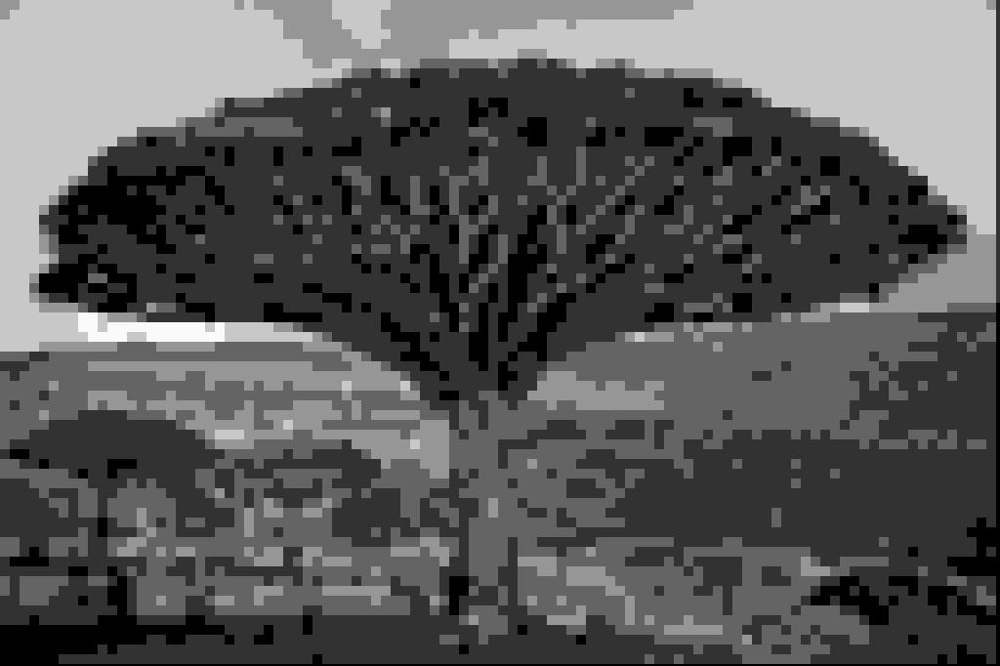
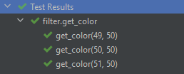

# Запуск изображений #

## изображение до: ##

## изображение после filter, filter_with_filename: ##

block_size = 10, grayscale = 50

## изображение после old_filter: ##

block_size = 10, grayscale = 50

Но т.к. он не исправлен нормального результата не выходит, в остальных случаях результирующее изображение в процессе каждой фильтрации получилось одинаковым, из-за одинаковых параметров фильтрации.

# Profiling #
## old filter: ##

## filter profile: ##

## filter with filename profile: ##

Как видно по фотографиям выше при запуске старого фильтра(ввод данных в котором отстутствует) на обработку изображения тратится большое количество времени. После запуска исправленного фильтра мы видим, что время работы программы увеличилось, однако замечаем что большая часть времени ушла на ввод данных, а обработка изображения занимает в разы меньше времени. Для объективности тестов мы смотрим результат работы фильтра с уже введенными параметрами, и объективно видим насколько быстрее начало обрабатываться изобраение.

# Doc-тесты #

## функция, к которой написаны doc-тесты: ##

## результаты doc-тестов: ##

1)  49 // 50 = 0;
    0 * 50 = 0;

    0=0✅

2)  50 // 50 = 1;
    1 * 50 = 50;

    50=50✅

3)  51 // 50 = 1;
    1 * 50 = 50;
    
    50=50✅

предполагаемые результаты совпали с фактическими ✅✅✅

# Debug #
## размеры изображения: ##

## размеры мозаики: ##

## градация серого: ##

Всю необходимую информацию нашли.✅✅✅